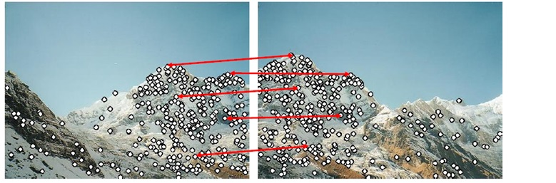
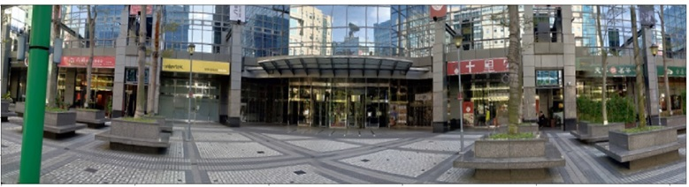
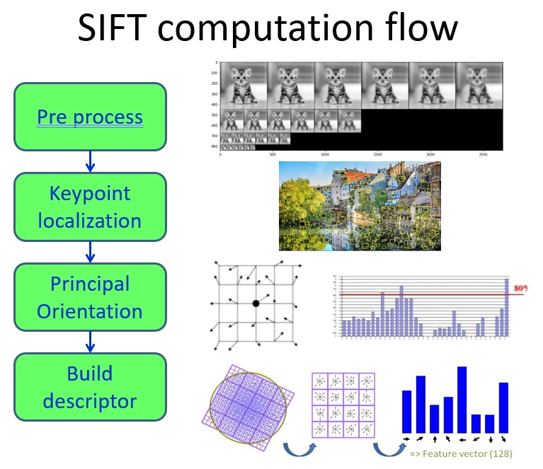

## SIFT (Scale Invariant Feature Transform)  
SIFT, a popular image matching algorithm extracts a set of descriptors from an image. The extracted descriptors are invariant to image translation, rotation and scaling. It has also proved to be robust to a wide family of image transformations, such as slight changes of viewpoint, noise, blur, contrast change, scene deformation, while remaining discriminative enough for matching purposes.
The SIFT algorithm consists of two successive and independent operations: 
(1) The detection of interesting points (i.e keypoints)
(2) The extraction of a descriptors associated to each of keypoints.
Since these descriptors are robust, they are usually used for matching pairs of images. Object recognition, video stabilization, and panorama are other popular application examples.
  
  

----
## SIFT signal processing flow
  
To improve SIFT accuracy, images are enlarged (doubled) and switch into gray-scale first. It implies that SIFT discard color information. 

----
## Reference:
> **Distinctive Image Features from Scale-Invariant Keypoints 2004**  
> David G. Lowe  
> [PDF] https://www.cs.ubc.ca/~lowe/papers/ijcv04.pdf 
