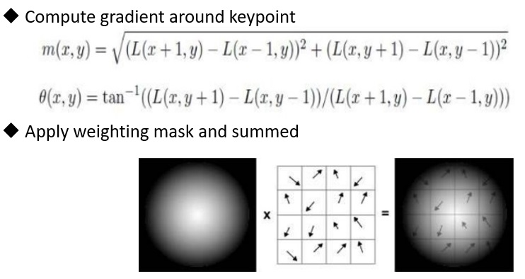

## SIFT (Scale Invariant Feature Transform)  
SIFT, a popular image matching algorithm extracts a set of descriptors from an image. The extracted descriptors are invariant to image translation, rotation and scaling. It has also proved to be robust to a wide family of image transformations, such as slight changes of viewpoint, noise, blur, contrast change, scene deformation, while remaining discriminative enough for matching purposes.
The SIFT algorithm consists of two successive and independent operations: 
(1) The detection of interesting points (i.e keypoints)
(2) The extraction of a descriptors associated to each of keypoints.
Since these descriptors are robust, they are usually used for matching pairs of images. Object recognition, video stabilization, and panorama are other popular application examples.
  
  

----
## Detection of interesting points
  
To improve SIFT accuracy, images are enlarged (doubled) and switch into gray-scale first. It implies that SIFT discard color information. 
Next, images are shrinked as 0.5X, 0.25X, 0.125X to form Gaussian image pyramic. Meanwhile, each image is further filtered by Gaussian filter to generate 6 sub-layers.
SIFT utilizes difference of consecutive Gaussian (DOG) to apply bandpass filter for different scale.  

Once the DOG banks are built, scan each DOG layer to find local extreme point. Extreme point means center point is maximum or minimum value in a 3x3x3 cube (X,Y,Z where Z means DOG layer). For stability, low contrast extreme points are discarded (magnitude< threshold). Meanwhile, edge points are discarded too by checking Hessian Matrix.

----
## Extraction of descriptors
SIFT would build descriptor for each keypoint. To guaranterr rotation invariant, SIFT detects principal orientation of keypoint first.

----
## Reference:
> **Distinctive Image Features from Scale-Invariant Keypoints 2004**  
> David G. Lowe  
> [PDF] https://www.cs.ubc.ca/~lowe/papers/ijcv04.pdf 
